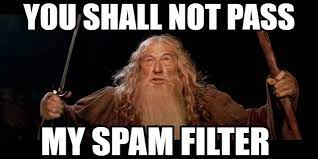

# SMS Spam vs Not Spam

 
 

### About the Task:

The SMS Spam Collection is a set of SMS tagged messages that have been collected for SMS Spam research. It contains one set of SMS messages in English of *5,574 messages*, tagged acording being ham (legitimate) or spam.

The dataset can be found [here on Kaggle](https://www.kaggle.com/uciml/sms-spam-collection-dataset).

### Solution

I have used 2 Models: LightGBM (with Tf-Idf vectors) and RoBERTa Base (with a custom attention head). Deeper descriptions provided in the notebooks.

Model Summary:

| Model | GPU Config | Execution Time (s) | CV Average | Test Score |
| --- | --- | --- | --- | --- |
| **LightGBM with Tf-Idf** | None | 72.1 | 0.96 | 0.96 |
| **RoBERTa Base** | Tesla P100 16GB | 282 | 0.98 | 0.99 |